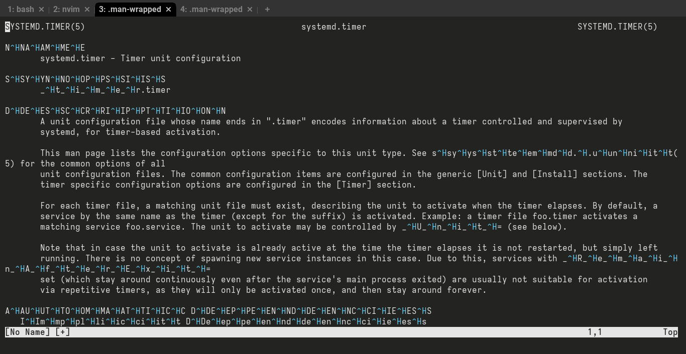
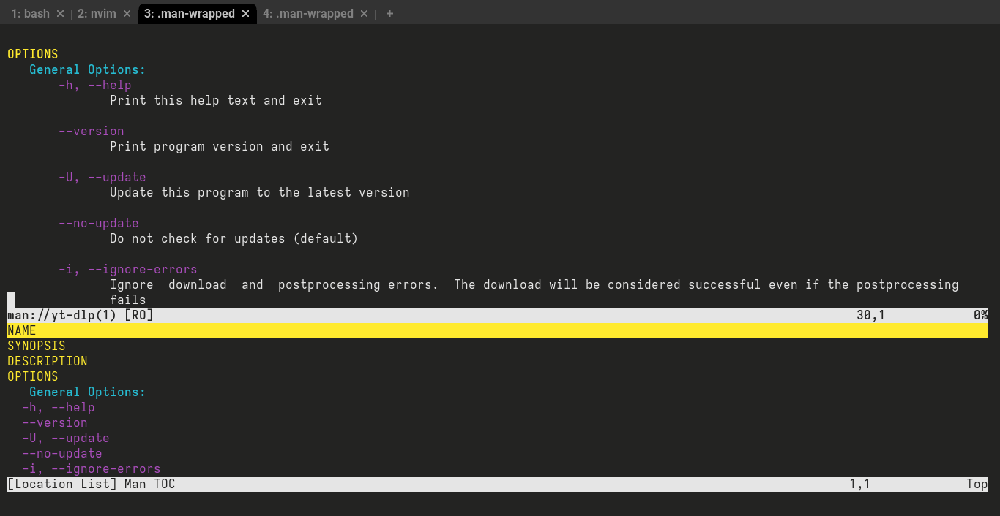
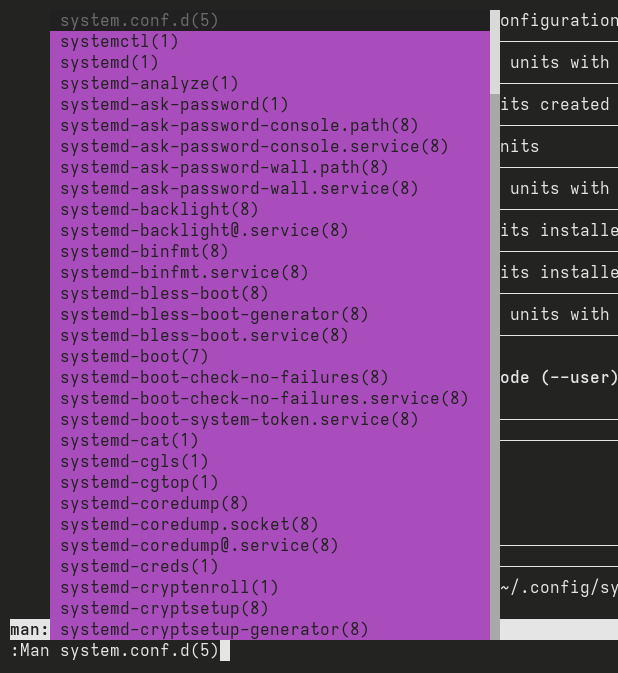
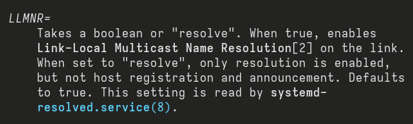
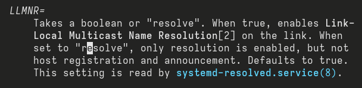
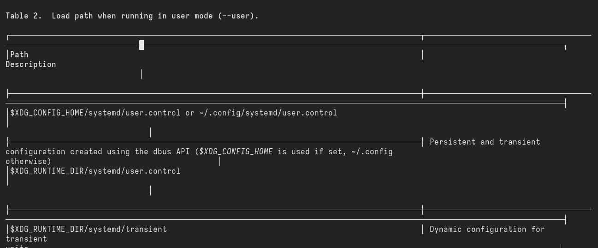
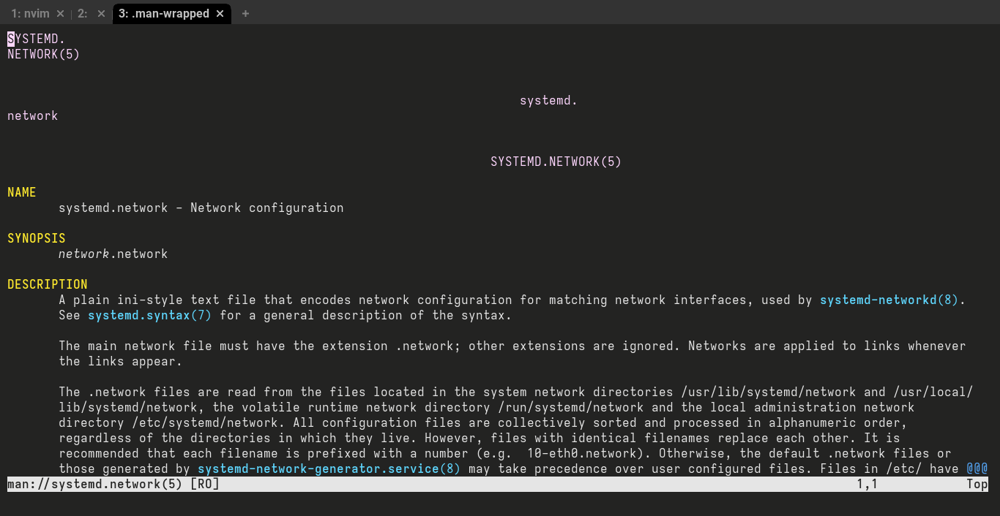

= Using Neovim as your manpager
Gabriel Arazas <foodogsquared@foodogsquared.one>
2023-03-12

If you're using Unix-like systems, then you've most likely dove into the manual pages (manpages) once.
It's a pretty neat offline documentation for those who need it (at least when there are manual pages for the application).

For those whose needs are simple, the default setup should suffice which its go-to manpages reader is `less`.
However, there are different programs for that purpose.
One of those is Neovim.
And it is very handy.

While most of the things featured here are pretty much laid out from `:Man` section from Neovim help documents, this post shows some niceties as well as some problems with this setup.

[NOTE]
====
I'll be featuring Neovim with the factory default settings.
Just assume that Neovim is executed with the `--clean` option enabled.

Also for future references, it is demonstrated with Neovim 0.9 (`v0.9.0-dev-f0ee548`).
====

== Setting things up

In order to use Neovim as a manual pager in the terminal, we have to modify `MANPAGER` environment variable.
Per the man:man[1] manual page:

[quote]
____
If `$MANPAGER` or `$PAGER` is set (`$MANPAGER` is used in preference), its value is used as the name of the program used to display the manual page.
By default, less is used, falling back to `cat` if `less` is not found or is not executable.

The value may be a simple command name or a command with arguments, and may use shell quoting (backslashes, single quotes,  or  double quotes).
It may not use pipes to connect multiple commands; if you need that, use a wrapper script, which may take the file to display either as an argument or on standard input.
____

All you have to do is to set `MANPAGER` environment variable (e.g., set in your shell profile, invoke with a custom `MANPAGER` one-time) with Neovim.

.Running a manual pager specifically with Neovim in Bash
[source, shell]
----
MANPAGER="nvim +Man!" man systemd.timer
----

For those who are curious, the above snippet is setting `MANPAGER` to be Neovim with the `:Man!` command — which will render the buffer passed to Neovim as a manpage. Take note the `+Man!` is required because otherwise, the text looks like a jumbled mess like in the following image.

.Neovim as a manpager without the `+Man!` command

== The niceties

There are a lot of good things Neovim has as a manual pager.
The biggest thing is, of course, navigating the manual page with Neovim.
Among other things, there are some more specific features that makes Neovim stands out as a pager.

For a start, here's a quickstart:

- Follow links from manpage to manpage with kbd:[K] which is very handy for navigating a suite of manpages like in systemd.

- Go back from the previous manpage where the current manpage opened from with kbd:[Ctrl+t].

- Keymaps associated with jumplists (i.e., kbd:[Ctrl+o] and kbd:[Ctrl+i]) are very useful to navigate between different manpages.

Here's a video that shows using Neovim with the previously mentioned keybindings.

video::./assets/neovim-manpage-navigation.webm[]

You can also navigate an outline of the document with kbd:[gO] which is nice to navigate large documents.

[NOTE]
====
Unfortunately by default, kbd:[gO] only works on `help` and `:Man` buffers as indicated from the Neovim help document.

Also, this feature is not found in Vim.
====

The outline will also show the flags and options if the manual page has a single- or double-dashed option at the beginning of a line (i.e., `--option`, `-flag`).

.The outline of man:yt-dlp[1]

Additionally, you can also read manpages easily with the `:Man` command while using Neovim.
It also comes with a nice tab completion.

.`:Man` with tab completion

== The problems

With its niceties, there are problems that you have to keep in mind.
In particular, the way how Neovim opens.

In the following video, there are two pagers: less and Neovim opening `configuration.nix(5)` which is at least 150,000 lines, 400,000 words counted, totalling just 9MB in size.
It should clearly show the different approach of opening.

For comprehension, here are several manpages that are quite big in comparison to the monstrous manual page. footnote:[This will vary between different systems with different versions and all.]

[#tbl:manual-pages-filesize]
.Various manual pages and their filesize
[%header, cols="1,1"]
|===
| Manual page
| Size (in MB)

| man:systemd[1]
| 0.055

| man:systemd.index[7]
| 0.13

| man:bash[1]
| 0.43

| man:systemd.directives[7]
| 0.8

| man:ffmpeg-all[1]
| 1.69

| configuration.nix(5)
| 9.01
|===

.Neovim versus less on opening `configuration.nix(5)`
video::./assets/neovim-vs-less-performance.webm[]

As you can see Neovim is magnitudes slower due to the approach of loading the whole file in memory before showing it unlike what less is doing. footnote:[To be fair, it's an github:neovim/neovim[issue for Neovim to open large files, issue=614].]
In practice, the difference can be negligible and only seen in larger documents since most manpages don't reach even just a single megabyte.

Another problem is some of the rendering for manual pages is not great.
Manpages in Neovim are rendered with hard-wrapping by default.
This causes some inconvenience with links such as the following image showing a cut link for `systemd-resolved.service(8)` with hard-wrapping enabled.

.A hard-wrapped text of the reference causing the link to be cut off

A workaround is to set `g:man_hardwrap` to false which will cause Neovim to render it with soft-wrapping.
You can run `let g:man_hardwrap=0` in Ex mode and view a manpage with `:Man` (for example `:Man systemd.unit(5)`) to see the difference.

.A soft-wrapped text of the same reference

Take note that by soft-wrapping, you can encounter some new formatting problems.
This is more noticeable with manpages that uses tables.

[#fig:neovim-soft-wrapped-tables]
.A soft-wrapped table in the man:systemd.unit[5] manpage

Another solution for this could be setting up `MANWIDTH` environment variable to a large number but this will make some formatting to be screwed up.
The following image is what happens when you set `MANWIDTH` to `999`.

.Neovim manpager with `MANWIDTH=999`

Take note you're also going to encounter the same problem as soft-wrapping it such as the <<fig:neovim-soft-wrapped-tables, previously shown jumbled tables>>.
Seems like github:neovim/neovim[there's a reason why it hard wraps by default, issue=11436].

== Conclusion

Overall, Neovim as a manpager is not without its problems.
It is, however, more useful for navigating manual pages compared to the default setup of most distributions.

- The ability to jump into links alone is worth enough for me suitable for navigating indices like man:systemd.directives[7].

- The handy-dandy `:Man` Ex command with tab completion is indeed handy for quickly checking manpages, bringing less need for a new shell.

- If you're familiar with Neovim, you're already set on navigating between different pages and/or large documents.
The additional things to learn is just negligible.

- You can also take advantage of its github:rockerBOO/awesome-neovim[plugin ecosystem].
There are a variety of plugins (e.g., github:easymotion/vim-easymotion[EasyMotion], github:ThePrimeagen/harpoon[harpoon]) to make text navigation a nicer experience.

