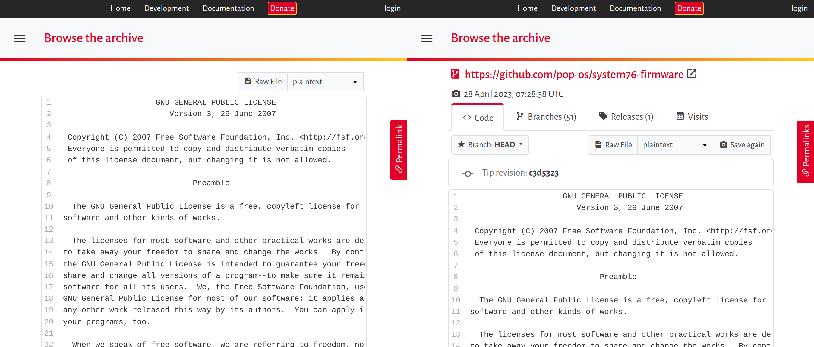
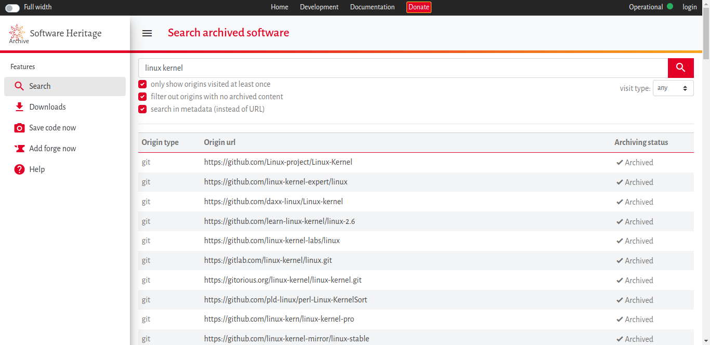

= Using Software Heritage for technical writing
Gabriel Arazas <foodogsquared@foodogsquared.one>
v1.1.0, 2023-05-19: Corrected information and update descriptions

include::./attributes.adoc[]

There's this nice service called link:https://www.softwareheritage.org/[Software Heritage], a large software archive intended to be used as a reference for software in writings (e.g., research papers, blog posts, technical documents).
We'll be showing how to take advantage of it for technical writing as it provides the following benefits.

- It offers a centralized and universal way of identifying and referring to software similarly to wikipedia:Digital_object_identifiers[Digital object identifers] (DOI).

- link:https://archive.softwareheritage.org/#swh-coverage-content[It consolidates all of the sources into one centralized archive], reducing the need to search and manage to different forges such as GitHub, GitLab, Bitbucket, and Sourcehut.

- Long-term preservation which mitigates against problems such as vanishing upstreams and sunsetting services.
For example, when referring to github:NixOS/nixpkgs[rev=nixos-22.11] and if ever GitHub goes down or if the Nix community decides to move into other Git forges, it will affect none of it once swh:{swh-nixpkgs-22-11}[the software has been archived within Software Heritage] and can be referred for the rest of time.

- It offers granularity to what part of the software technical writers can refer to from the whole project, to a certain point in history, to certain files and directories, and all the way down to lines of code.

[#how-software-heritage-works]
== How Software Heritage works?

Software Heritage link:https://archive.softwareheritage.org/coverage[actively archives software from several sources] such as...

- Software forges like GitHub, GitLab instances, and even Gitea instances.
- Linux distributions package archives such as from Debian, Nix, and Guix.
- Several software indices such as PyPi, crates.io, and npm.

The service will periodically capture a snapshot of the same software project (which we have access to, among other things as we'll see later in the post).

[NOTE]
====
One thing you have to keep in mind with this service is the project developers don't check the source code for any issues (e.g., quality, intent).
Whatever that is stored from the original source will be included as part of the archive.
====

Furthermore, link:https://archive.softwareheritage.org/save/[it can save source code that is managed by different version control software] such as Git, Mercurial, and Subversion.
Software Heritage is also offering its services with its link:https://archive.softwareheritage.org/api/1/[API over HTTPS] which is nice if you want to create some neat little scripts or integrate it in your software.
Most of the functionality are already available with its website which I covered in <<using-the-software-heritage-archive-website, a later section>>.
But first, we'll have to learn an important concept with Software Heritage: its identifier system to access the archive in the first place.

[#sidebar:dialog-on-archive-statistics]
.Dialog on archive statistics
****
[chat, Ezran, state=proud, role=reversed]
====
As of 2023-05-11, Software Heritage contains at least 230 million projects with 3.2 billion commits.
It is only expected to go up throughout the years.
GitHub takes the majority of the sources as the archive have 175 million projects from it.
====

[chat, foodogsquared, state=curious]
====
Does that include forks and everything?

Also, that's a bit scary to think about GitHub having 75% of the archive.
What about the second largest?
====

[chat, Ezran, role=reversed]
====
I'm fairly sure it does include forks in the archive which makes the actual number of projects a lot less but it is still an impressive count considering the wide coverage of sources they monitor.
They only archive public repos or if the user opt in of the archival integration such as link:https://docs.github.com/en/enterprise-cloud@latest/get-started/privacy-on-github/opting-into-or-out-of-the-github-archive-program-for-your-public-repository[in GitHub].

As for the second largest source, it seems to come from GitLab instances totalling... 4 million projects.
That's at least 1%.
====

[chat, foodogsquared, state=disappointed]
====
Well, that's at least... unfortunate.
====
****

[#its-identifier-system]
== Its identifier system

The main intention of the project is to provide a centralized archive for identifying and referencing software.
The primary way of using such service is with an identifier system like wikipedia:Digital_object_identifiers[DOI] for digital objects, wikipedia:ISBN[] for books, and wikipedia:International_Standard_Musical_Work_Code[ISWC] for music.
Software Heritage uses its own identifier system called link:https://docs.softwareheritage.org/devel/swh-model/persistent-identifiers.html[SoftWare Heritage persistent IDentifier] or SWHID for short.
The identifier follows a certain format.

.Parts of SWHID

The following examples should be enough to show what they look like.

[#tbl:swhid-list]
.Examples of SWHIDs
[%header.break-anywhere,cols="2,1"]
|===
| SWHID
| Description

| swh:{swh-bare-system76-firmware-license}[]
| GPLv3 document.

| swh:{swh-bare-nixpkgs-22-11-maintainers-dir}[]
| `maintainers/` directory from github:NixOS/nixpkgs[opts=repo].

| swh:{swh-bare-nixpkgs-22-11}[]
| 22.11 branch of github:NixOS/nixpkgs[opts=repo].

| swh:{swh-bare-gnome-shell-3-38-6}[]
| gitlab:GNOME/gnome-shell[GNOME Shell v3.38.6, domain={gnome-gitlab}, rev=3.38.6] release.

| swh:{swh-bare-gnome-shell-jan-4-2023}[]
| A gitlab:GNOME/gnome-shell[opts=repo] snapshot.
|===

As you can tell from the table, SWHID also offers some control of granularity of what parts of software we want to refer: from individual files and directories, from a certain point in the history of the project, and from a certain point of time of capture.

[NOTE]
====
The parts of software such as files, directories, and revisions are collectively referred to as software artifacts (or objects) as you'll see from its documentation.
====

[chat, foodogsquared, state=curious]
====
What about pointing to specific lines of code?
Didn't the preamble mentioned something like "granularity down to the lines of code"?
====

[chat, Ezran, role=reversed]
====
You'll see it later.
====

An interesting property with SWHIDs is that they are intrinsic identifiers: meaning you get the object alongside the identifier.
Unlike DOIs and ISBNs where objects are arbitrarily assigned by a central authority, SWHIDs are computationally generated from the object.
This means SWHIDs are deterministic and we can do a reverse lookup with the object.
In fact, it can be computed with objects locally in your machine.

Due to its intrinsic nature of SWHIDs and with the ability to refer various parts of a software, we're also slowly unraveling the fact that Software Heritage archive itself is essentially a gigantic wikipedia:Merkle_tree[Merkle tree] where it contains several objects.
Let's go back to the <<tbl:swhid-list, previous table of SWHIDs again>> and see what those are.

- A content object contains the content of a file.

- A directory object contains other directory objects and content objects.

- A revision object is a point in time of the development history of the project.
It also points to the root directory of the project.

- A release object is essentially the same as a revision object but with additional metadata.
In practice, this is typically the revision developers tagged for release (e.g., KDE Plasma 5.23, GNOME 42, Linux kernel 6.3).

- A snapshot object contains the whole source code including all visible branches at that point in time.

[#sidebar:similarities-with-git]
.Similarities with Git
****
[chat, foodogsquared]
====
Wait... this sounds similar to the link:https://git-scm.com/book/en/v2/Git-Internals-Plumbing-and-Porcelain[Git internals].
====

[chat, Ezran, role=reversed]
====
That's because it is using a similar data model as Git with the graph objects and even the object identifier being a hex-encoded SHA1 hash.
====

[chat, foodogsquared, state=curious]
====
Does this mean it is compatible with Git then?
====

[chat, Ezran, role=reversed]
====
Yes but it is more coincidental than anything.
This is especially clearer once you noticed the service supports importing software from version control software other than Git.
Just don't expect that to work every time.
====
****

== SWHID qualifiers

While the <<tbl:swhid-list, previously shown SWHIDs>> is enough and working as intended, there are some lack of information with the identifier alone.
From the identifier system, one cannot easily infer certain information that we often needed such as the URL of the repository and the path relative to the repository.
This is also reflected in the website interface if you've visited the links where it just strictly presents the software artifact (e.g., content, directory, revision).

- Let's take swh:{swh-bare-nixpkgs-22-11-maintainers-dir}[] as an example where we just see a directory and nothing else.

- Or let's take the swh:{swh-bare-nixpkgs-22-11}[] where we see visit a revision of the project but we cannot see if it came from github:NixOS/nixpkgs[the canonical repository].

- With yet another example, let's take swh:{swh-bare-system76-firmware-license}[] where the exact content object can appear for GPLv3-licensed projects. footnote:[You cannot modify the GPLv3 document itself since it is a copyrighted document so any GPL-licensed projects should have the same license text thus the same object.]
Not to mention we can't tell where the license file is located in the repository, let alone the repository.

This is because of the data model of the archive being a gigantic Merkle tree where objects may be shared among multiple projects.
This makes certain tasks to be tedious such as identifying whether the artifact belong from a canonical repository or one of its many forks which is also included in the archive.

Because of this, SWHIDs may also have a semicolon-delimited (`;`) list of qualifiers that adds contextual information.

.SWHID with qualifiers

Each qualifier may mean different things which is https://docs.softwareheritage.org/devel/swh-model/persistent-identifiers.html#qualifiers[documented nicely in its website].
Let's take the <<tbl:swhid-list, previous table>> and add more contextual information with it.

[#tbl:swhid-with-qualifiers]
.Previous SWHIDs with contextual information
[%header.break-anywhere,cols="2,1"]
|===
| SWHID
| Description

| swh:{swh-system76-firmware-license}[opts=full]
| Section 11 of the GPLv3 license from github:pop-os/system76-firmware[opts=repo].

| swh:{swh-nixpkgs-22-11-maintainers-dir}[opts=full]
| `maintainers/` directory from the nixpkgs-22.11 branch from the canonical nixpkgs repository.

| swh:{swh-nixpkgs-22-11}[opts=full]
| A certain revision from the nixpkgs-22.11 branch from the canonical nixpkgs repository.

| swh:{swh-gnome-shell-3-38-6}[opts=full]
| The gitlab:GNOME/gnome-shell[canonical GNOME Shell v3.38.6 release, domain={gnome-gitlab}, rev=3.38.6].

| swh:{swh-gnome-shell-jan-4-2023}[opts=full]
| A snapshot of the gitlab:GNOME/gnome-shell[canonical gnome-shell repository, domain={gnome-gitlab}] captured on January 4th of 2023.
|===

If you click each of the link, the website interface is more complete compared to the <<tbl:swhid-list, previous table of SWHIDs>>.

[#fig:side-to-side-comparison-swhid-with-and-without-qualifiers]
.Side-to-side comparison of the website interface for `{swh-bare-system76-firmware-license}` without and with qualifiers

This practice of adding contextual information is recommended as link:https://www.softwareheritage.org/faq/#34_Which_type_of_SWHID_should_I_use_in_my_articledocumentation[documented from its FAQ].
More specifically, the contextual information has to be as full as possible which you can easily get the identifier with all relevant qualifiers in its archive website interface which we'll cover next.
You can see more of them from <<appendix:guidelines-for-referencing-swhids>>.

[NOTE]
====
While the link text shown in the table are shown with the complete identifier with all qualifiers, it is recommended to show only the core identifier as the link text.
This is to address the obvious problem of length making it harder to read.
For a proper example of a hyperlink, here is one with swh:{swh-system76-firmware-license}[].
====

[chat, foodogsquared, state=curious]
====
So what happens when I give a qualifier with a wrong value such as the `origin` qualifier that points to an non-existent origin or an `anchor` qualifier that points to an invalid SWHID?
====

[chat, Ezran, role=reversed]
====
Why don't you try those out yourself?
Here's a list of them just for starters.

[.break-anywhere]
- swh:{swhid-content-with-invalid-origin}[A `swh:cnt:` with invalid origin, opts=full]
- swh:{swhid-dir-with-invalid-anchor}[A `swh:dir:` with invalid anchor, opts=full]
- swh:{swhid-content-with-invalid-path}[A `swh:cnt:` with invalid path, opts=full]

You could also mix and match qualifiers that are not supposed to appear in certain object types such as the `lines` qualifier in non-content objects.
====

[#using-the-software-heritage-archive-website]
== Using the Software Heritage archive website

Throughout the Software Heritage ecosystem, there are tools that make use of the service.
Its main interface is on the link:https://archive.softwareheritage.org/[archive website interface] is what you're likely to use the most.
The workflow from the website interface is pretty simple: you search for the origin of the software, enter the corresponding object, and specify what you want to refer to. footnote:[Y'know, identifying and referring parts of software as this point is already hammered multiple times by this point. :)]

The most important thing to note with this website is using it as a resolver for SWHIDs that is similarly used with link:https://dx.doi.org/[DOIs].
You've already seen its usage with the links from the previous tables such as in <<tbl:swhid-list>> and <<tbl:swhid-with-qualifiers>>.
Using it as a resolver is simple: just append the identifier on the root endpoint of the service.

[literal]
----
https://archive.softwarearchive.org/$SWHID
----

With the user-facing side of the website, what you'll see first is a search interface.
Take note the quality of the search results is not perfect nor usable if you're not aware of the quirks of its search engine.
For example, merely entering the name of the software is not typically enough for searching.

[#fig:website-search-result-linux-kernel-query]
.The search result for the query "linux kernel"

Even searching with metadata doesn't help.

[#fig:website-search-result-linux-kernel-query-with-metadata]
.The search result for the query "linux kernel" with metadata

It's pretty obvious that it doesn't have enough quality results.
Instead, I recommend to enter the origin URL that you're searching for (e.g., `https://github.com/torvalds/linux`).
If there is an exact match of the given origin, the website will directly go to the page of the software artifact with that origin.
This is especially nice for the sources it already monitors such as GitHub, GitLab instances, and Gitea instances.
This even works for package indices such as Pypi and npm (e.g., `https://pypi.org/project/swh.core`, `https://www.npmjs.com/package/vue`).
For more details, there is link:https://archive.softwareheritage.org/coverage/[a dedicated page on what sources are being monitored] which you can infer what URLs can be resolved in this way.

Once you get into the software artifact of your choosing (e.g., directory, file, revision, snapshot), you can get the identifier with the permalink tab on the side of the website.

[#vid:archive-website-using-permalink-tab]
.Using the permalink tab on the website
video::./assets/archive-website-using-permalink-tab.webm[]

[#other-software-heritage-tools]
== Other Software Heritage tools

Other than the link:https://archive.softwareheritage.org/[website], there are tools available to easily make use of the service.
The ecosystem of Software Heritage is somewhat limiting as Software Heritage itself is relatively young but it does have nice tools to begin with.
Let's take a closer look at them.

- link:https://docs.softwareheritage.org/devel/swh-model/cli.html[`swh identify`] is a command-line interface that prints the SWHID of the given objects.
SWHID are computationally generated that can be done locally which is nice if you have the codebase on disk and want to refer to them through the archive.

- A nice way to explore the archive is with link:https://docs.softwareheritage.org/devel/swh-fuse/index.html[Software Heritage Filesystem] (SwhFS) which comes with a command-line interface (`swh fs`).
This tool alongside `swh identify` is one way to explore the archive entirely on the terminal.

- link:https://docs.softwareheritage.org/devel/swh-web-client/[A web client for SWH in Python] which is nice if you're using Python in the first place.

- link:https://www.softwareheritage.org/browser-extensions/[Some SWH-related browser extensions.] footnote:[As of 2023-05-09, only one is made public so far.]
Among them is the link:https://www.softwareheritage.org/browser-extensions/#UpdateSWH[UpdateSWH] which checks and includes the archival of a repository in the queue, all in a simple interface.

- For those who are writing with LaTeX, ctan:biblatex-software[there is a package for adding software entry types in BibLaTeX].

Furthermore, there are initiatives to integrate it with projects such as with link:https://www.softwareheritage.org/2019/04/18/software-heritage-and-gnu-guix-join-forces-to-enable-long-term-reproducibility/[Guix] and link:https://nlnet.nl/project/SoftwareHeritage-P2P/[peer-to-peer access with IPFS].

[#sidebar:swh-tools-wishlist]
.SWH tools wishlist
****
As the ecosystem around Software Heritage is young, there are some tools and services that could use and integrate with the service.
The following list is what I would like to see.

- More integration with software forges.
Though this could be implemented with browser extensions, it would be nicer if forges such as GitHub and Gitea can integrate the service even if it through extensions.
GitHub already has some foundations with this feature as link:https://github.blog/2021-08-19-enhanced-support-citations-github/[it has citation support].

- link:https://www.zotero.org/[Zotero] integration with the service.
You could go into the archive and quickly get the reference just as you would on link:https://arxiv.org[arXiv].
****

[#appendix:guidelines-for-referencing-swhids]
[appendix]
== Guidelines for referencing SWHIDs

While using SWHIDs is a done-and-forget procedure (for the most part), there is a set of guidelines to make usage of them a bit easier.

- Per the link:https://docs.softwareheritage.org/devel/swh-model/persistent-identifiers.html#choosing-what-type-of-swhid-to-use[documentation], it is recommended to use `swh:dir:` SWHIDs over `swh:rev:` or `swh:rel:` since `swh:dir:` can be computed without relying on the Software Heritage archive.
The revision and release identifiers are mostly used as part of the metadata such as the one example from <<tbl:swhid-with-qualifiers>>.

- As already mentioned, SWHIDs with full contextual qualifiers are recommended.
This should be easy to retrieve considering the website interface gets them for you as seen from <<vid:archive-website-using-permalink-tab, this video>>.

- If you want to create a hyperlink, it is advisable to make the core identifier as the link text to address the obvious problem of length making it harder to read (case in point, <<tbl:swhid-with-qualifiers, in this table>>).
For a proper example of a hyperlink, here is one with swh:{swh-system76-firmware-license}[].

[#appendix:extending-asciidoctor-for-linking-swhids]
[appendix]
== Extending Asciidoctor for linking SWHIDs

Linking SWHIDs could be tedious when writing documents.
In link:https://asciidoctor.org[Asciidoctor], there are features where this makes it easier.
Specifically, we're talking about storing the identifiers in link:https://docs.asciidoctor.org/asciidoc/latest/attributes/document-attributes/[document attributes].

.Using attributes for storing and linking SWHIDs
[source, asciidoc]
----
:swh-system76-firmware-license-core-identifier: swh:1:cnt:94a9ed024d3859793618152ea559a168bbcbb5e2
:swh-system76-firmware-license: swh:1:cnt:94a9ed024d3859793618152ea559a168bbcbb5e2;origin=https://github.com/pop-os/system76-firmware;lines=471-538

link:https://archive.softwarearchive.org/{swh-system76-firmware-license}[{swh-system76-firmware-license-core-identifier}]
----

In my opinion, this is still tedious since we have to store two attributes that would need separate changes where it should be only one.
Fortunately, Asciidoctor can be extended to introduce new syntax which xref:{asciidoc-go-template-hugo-featuring-nix-post}[I've previously shown how Asciidoctor can be extended].
We can apply a similar solution here.

[NOTE]
====
This is the very solution used for linking SWHIDs in github:foo-dogsquared/website[my website].
====

For our initial version of the new syntax, it looks like the following.

[source, asciidoc]
----
swh:$SWHID[$CAPTION]
----

It is an link:https://docs.asciidoctor.org/asciidoctor/latest/extensions/inline-macro-processor/[inline macro] that accepts an SWHID and can accept a caption as the link text.
Take note the caption is optional with the core identifier being the default caption.
The following listing should show a complete list of use cases we considered for this macro.

.`sample.adoc`
[source, asciidoc]
----
include::git:{doccontentref}[path=swhid-sample.adoc]
----

The inline macro should produce a link target to the default SWHID resolver at `https://archive.softwareheritage.org`.
Anyways, here's the code for the `swh` Asciidoctor extension.

.`lib/asciidoctor/swhid-inline-macro/extension.rb`
[source, ruby]
----
include::git:{doccontentref}[path=lib/asciidoctor/custom_extensions/swhid_link_inline_macro.rb]
----

[NOTE]
====
As an exercise, you could add an option to replace the resolver domain with the `resolver` attribute.
Furthermore, you could add a procedure to check whether the given SWHID is valid or not.
====

You cannot make use of the extension as it is not registered within the Asciidoctor registry yet.
Let's make the file that does that.

.`lib/asciidoctor-custom-extensions.rb`
[source, ruby]
----
include::git:{doccontentref}[path=lib/asciidoctor-custom-extensions.rb]
----

Now with the extension in place, you can use it with Asciidoctor like with the following listing.

[source, shell]
----
asciidoctor -r ./lib/asciidoctor-custom-extensions.rb sample.adoc
----

Voila!
Now you have an nicer way of linking them SWHIDs with the archive.
This extension should be usable for all backends since it is a simple shorthand for linking SWHIDs to the archive.
