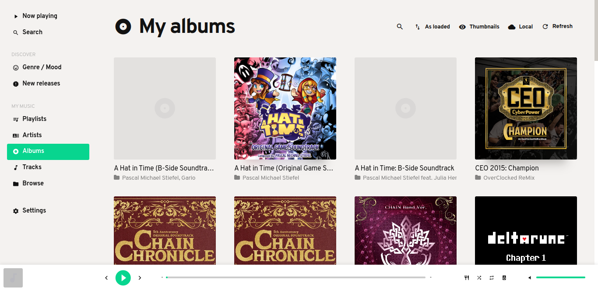
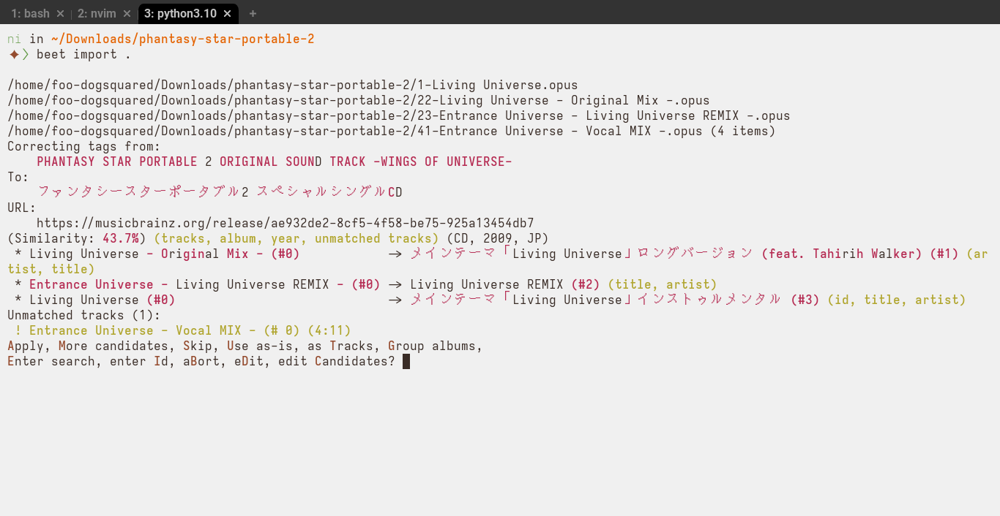

= My offline music streaming setup
Gabriel Arazas <foodogsquared@foodogsquared.one>
v1.0.0, 2023-05-30: Initial version

:swh-gonic-service-unit-contrib: swh:1:cnt:4a2128ff5d679b1eceac27464f2ccbd5c3dabc90;origin=https://github.com/sentriz/gonic;visit=swh:1:snp:c9ba117bcd80577fa6dbae0293c45e3d6488c08c;anchor=swh:1:rev:2f4ea6caa86afb8c78fda4efcd1d4a5e8aa18c60;path=/contrib/gonic.service
:swh-gonic-service-nixpkgs: swh:1:cnt:65cf10f2c4b4623770b7006e927dc5838f3c7920;origin=https://github.com/NixOS/nixpkgs;visit=swh:1:snp:4b4f22375c9650345eb207a70c0158f951386514;anchor=swh:1:rev:1eae9f8f1b6a444b15d9037d4b8f2ca7da045a3f;path=/nixos/modules/services/audio/gonic.nix;lines=40-85

:mopidy-site: https://mopidy.com
:mopidy-docs: https://docs.mopidy.com

I like some music alongside whatever I'm doing something else... sometimes. footnote:[Not always, I find music sometimes distracting.]
While I typically go with a music streaming service like Spotify, sometimes it is done with my offline music collection.

A music streaming service like Spotify, while nice with the vast library of music you have access to, is not a replacement with the local music collection.
Especially with the dangers of a cloud service where if Spotify being down will make your music collection inaccessible for the time.

It's fun to document my setup every once in a while and the topic to tackle for this post is music management.
It is especially nice for those who are into music archival or just want to have a nice digital, well-organized music collection.

[IMPORTANT]
====
For future references, here are the following components assumed for this post as well as its versions.

- Mopidy v3.4.1
- systemd v253
- Beets 1.6.0 with Python 3.10.x
- gonic v0.15.2
- home-manager version 23.05
- NixOS version 23.05
====

[%collapsible#sidebar:dialog-on-acquiring-music]
.Dialog on acquiring music
****
[chat, Ezran, state=curious, role=reversed]
====
How do you download those into your local collection anyways?
I hope you're not just downloading them with a tool without paying for it.
====

[chat, foodogsquared, state=disappointed]
====
Says the one who bootlegs recordings borrowed from their friends...
====

[chat, foodogsquared]
====
Also, I paid for some of them.
Otherwise, I just use a tool like github:spotDL/spotify-downloader[spotDL] and github:yt-dlp/yt-dlp[opts=repo].
Although sometimes I do use YouTube Music instead of Spo-
====

[chat, Ezran, state=angry, role="reversed shake"]
====
**Hey, I paid for some of those cassettes, CDs, and whathaveyou!**

Also, those bootlegs are for me!
Completely legal.
====
****

[#mopidy]
== Mopidy

Half of the personal music streaming setup is link:{mopidy-site}[Mopidy], a music server with link:{mopidy-site}/ext/[a very nice ecosystem].
With more of the ecosystem, you can use other extensions that adds sources such as in github:mopidy/mopidy-spotify[Spotify], github:natumbri/mopidy-youtube[YouTube], github:tkem/mopidy-internetarchive[Internet Archive], and gitlab:funkwhale/mopidy[Funkwhale, domain=dev.funkwhale.audio].

Mopidy is a music server that comes with only a command-line interface which you can see more details on man:mopidy[1].
For a start, Mopidy has link:{mopidy-docs}[a comprehensive quickstart] and repology:mopidy[it is widely available on mainstream Linux distributions] such as Debian, Arch Linux, and Fedora.
While installing Mopidy varies between distributions, typically installing Mopidy consists of installing Mopidy itself and additional extensions.

- The one I recommend the most is github:jaedb/iris[Iris] which is a Mopidy extension that adds a web-based interface for managing and playing music with your Mopidy configuration.
+
.Iris music player

- Another extension I would recommend is github:mopidy/mopidy-mpd[opts=repo] which adds an link:https://www.musicpd.org/[MPD]-compatible server.
With the MPD server enabled, you can then use MPD clients such as github:yktoo/ymuse[Ymuse] and github:ncmpcpp/ncmpcpp[opts=repo].

- Lastly, I would install additional extensions for other sources such as YouTube, Internet Archive, and Funkwhale.

After installing the extensions you need, it is time to configure it with a plain-text file.
You have to be a bit familiar with the configuration syntax of Mopidy which uses an wikipedia:INI_file[INI]-like format.
For an example, here's my Mopidy configuration barring sensitive parts such as my Last.fm and Spotify account secrets.

[#lst:mopidy-configuration]
.`~/.config/mopidy/mopidy.conf`
[source]
----
include::./assets/mopidy.conf[]
----

[NOTE]
====
Since INI format doesn't have a clear way of specifying list, Mopidy has a format tweak where lists look like the following.

[source]
----
key =
  value1
  value2
  value3
----

This is seen with the value of `file.media_dirs` which is a list of directories with an optional name separated by a pipe (i.e., `|`) and in `internetarchive.collections` which is a list of Internet Archive playlists to be included in the server.
====

Among other things, the <<lst:mopidy-configuration, above configuration>> does the following...

- Initiate the Mopidy server at localhost.
- Adds local source from `$XDG_MUSIC_DIR` and other locations.
- Interacts with the playlists (in wikipedia:M3U[M3U format]) from `$XDG_MUSIC_DIR/playlists`.
- Adds link:https://archive.org/[Internet Archive] playlists.

[#sidebar:points-of-interest-for-mopidy-documentation]
.Points of interest for Mopidy documentation
****
link:{mopidy-docs}[Mopidy's documentation] is fairly comprehensive.
Here are some of the pages you're more likely to go back repeatedly.

- link:{mopidy-docs}/en/latest/config[The configuration section] contains references to the base configuration.

- Its bundled extension page also contains reference to what configuration options it can accept and what value it expects.

- They have a link:{mopidy-docs}/en/latest/troubleshooting[document for common troubleshooting issues] should you find yourself stuck on one.
****

With the configuration complete, you'll have to start the server by simply running `mopidy`.
However, it would be preferable to activate the server at the startup.
If you're using systemd, you could create a service unit as described from man:systemd.service[5].

[#lst:mopidy-service]
.`~/.config/systemd/user/mopidy.service`
[source, ini]
----
include::./assets/mopidy.service[]
----

[TIP]
====
`%E/mopidy/mopidy.conf` corresponds to whatever `XDG_CONFIG_HOME` resolves to.
You can see more of these specifiers from man:systemd.unit[5] "Specifiers" section.
====

Then you could enable the service with the following command.

[source, shell]
----
systemctl --user enable --now mopidy.service
----

Hoorah!
Now you have an offline music server!
While you could manage your collection in Iris, there are better tools suited for that task which we'll cover next.

[#beets]
== Beets

link:https://beets.io/[Beets] is a music management system for organizing your music collection — embedding proper metadata, organizing file structure, and more.
This is what I use to organize my music directory which makes it usable for other services that expect organized structure such as Mopidy and Gonic.
The most notable thing with Beets is it uses metadata from link:https://musicbrainz.org/[MusicBrainz] (at least by default).

Using Beets is very similar with using Mopidy:

- It is repology:beets[widely available on mainstream Linux distributions].
- It may require installing additional plugins for more capabilities.
- It starts with configuring the program with a plain-text file.

Furthermore, Beets also comes with a command-line interface with a user manual at man:beet[1].

How you configure Beets is through a plain-text file stored at a default configuration file which you can show with the following command.

[source, shell]
----
beet config --path --default
----

You can easily edit the configuration file with `beet config --default --edit`.
There are link:https://beets.readthedocs.io/en/stable/reference/config.html[a lot of tweaks and behaviors you can change] but it is easier to show an example configuration like in the following listing.

[#lst:beets-configuration]
.`~/.config/beets/config.yaml`
[source, yaml]
----
include::./assets/beets.yml[]
----

[NOTE]
====
If you're changing how the auto-tagging match works with link:https://beets.readthedocs.io/en/stable/reference/config.html#autotagger-matching-options[its related options], the matches that Beets accepts change significantly.
For example, if you've modified link:https://beets.readthedocs.io/en/stable/reference/config.html#required[`match.required`] to enforce accepting matches with year and a label, you'll be missing out on a lot of matches since not every database entry on MusicBrainz are uniform.
====

Among other things in the configuration, you'll need to explicitly specify which plugins to use (which Beets comes with an link:https://beets.readthedocs.io/en/stable/plugins/index.html[extensive list of them]).
Anyways, here's what my configuration does.

- It automatically creates playlists separated by year with the link:https://beets.readthedocs.io/en/stable/plugins/smartplaylist.html[`smartplaylist` plugin].
This is what part of <<lst:mopidy-configuration, my Mopidy configuration>> gets its playlist from. footnote:[Though, you can also create your own playlist as long as it doesn't conflict with the autocreated ones.]

- The import process also fetch the album art from MusicBrainz which is nice for music players.
This is enabled by link:https://beets.readthedocs.io/en/stable/plugins/fetchart.html[`fetchart` plugin].

- The import process also scrubs the metadata in music files with the link:https://beets.readthedocs.io/en/stable/plugins/scrub.html[`scrub` plugin].

[sidebar:a-few-interesting-beets-plugins]
.A few interesting Beets plugins
****
There's still possible changes for my Beets configuration since it offers so much.
A few points of interest for me are...

- Importing playlists from a Subsonic server with the link:https://beets.readthedocs.io/en/stable/plugins/subsonicplaylist.html[`subsonicplaylist` plugin].
This is especially nice if you have a self-hosted Subsonic-compatible server such as github:sentriz/gonic[opts=repo].

- Easily sharing my Beets library with the link:https://beets.readthedocs.io/en/stable/plugins/ipfs.html[`ipfs` plugin].

- Extracting the BPM with link:https://beets.readthedocs.io/en/stable/plugins/bpm.html[`bpm` plugin] which prompts you to rhythmically confirm the BPM.
****

After configuring it, you can then start using Beets.
The workflow of Beets is pretty simple: it is a music management system that comes with an library database (configured with `library` option).
Beets only considers music files that are included in the library database.
To get started, we have to fill the library database with some music files with the following command.

[source, shell]
----
beet import ~/Downloads/music
----

Beets will then start to match metadata of the audio files into its sources (such as MusicBrainz and Deezer) and prompts the user what to do next.

[#fig:beet-import-process]
.`beet import` usage

Beets, with all of its niceties, have a lot of problems especially with the auto-tagging feature.
The most notable thing being the performance which is link:https://beets.readthedocs.io/en/stable/guides/tagger.html#an-apology-and-a-brief-interlude[already acknowledged from the user manual].
It is pretty slow especially once you import multiple music files from multiple albums.

Another situation that performance can really hinder is importing larger albums where Beets prompts multiple times.
Take note that importing music in the same collection make Beets not only prompt but also merge them which takes some more time.
This means you really have to pay attention.
Thankfully, Beets can resume import if the process has been interrupted.
Still, auto-tagging can be a tedious experience.

[chat, foodogsquared]
====
Just imagine the <<fig:beet-import-process, previous image>> but Beets only recognizes one part of the album at a time.
Rinse and repeat until all tracks are in the album.
But then between each time it prompts there's an additional prompt to make you either merge the album which takes up more time.

That's the dilemma for larger albums.
====

[chat, Ezran, role=reversed]
====
Sounds tedious.
Why don't you just use something like link:https://picard.musicbrainz.org/[MusicBrainz Picard]?
It is more integrated and seems to be more responsive as an auto-tagger.
====

[chat, foodogsquared]
====
Yeah but I want my well-organized and completely-managed-by-Beets music library though.
====

[#gonic]
== Gonic

While this component is not essential if you're the only user of the setup, it would be nice to have it distributed as a server.
One of the most common way to distribute your local collection as a streaming server is with link:https://subsonic.org[Subsonic] which able to attract programs and extensions such as github:Prior99/mopidy-subidy[a Mopidy extension].

However, we're not going to use Subsonic itself as it hasn't been active in its development which led to forks and compatible servers such as link:https://airsonic.github.io/[Airsonic], link:https://navidrome.org/[Navidrome], and link:https://funkwhale.audio/[Funkwhale].
Instead, we're using github:sentriz/gonic[opts=repo], one of the Subsonic-compatible servers and it is lightweight enough for my needs compared to the aforementioned servers.
More specifically, I like that it has the following features.

- Listenbrainz scrobbling.
- It has internet radio support (which some Subsonic clients apparently make use of).
- Multi-user with their own preferences, data, and whatnot.

The last one being the most important which I could then share the server with other music listeners.

[chat, Ezran, state=curious, role=reversed]
====
Wait!
Why do you have two music servers anyways?
====

[chat, foodogsquared]
====
I would like to distribute my audio for my other devices which Mopidy is not suited for.
Mopidy is closer to MPD by design which is more focused on playing music on the device running the server.
====

[chat, foodogsquared, state=cheeky]
====
I could also share the server with other users for their music collection.
====

[chat, Ezran, role=reversed]
====
Fair point, I guess.
====

[NOTE]
====
Unlike Mopidy (or the next tool), repology:gonic[Gonic is not as available as the other featured tools] (as of 2023-05-27) so you'll have to build the source code yourself.
====

Using Gonic first starts with configuring the server.
There are different ways to configure it.

- With passing arguments on the command-line interface.
- With a plain-text file which have to be indicated with `-config-path` option on the command-line interface.
- With environment variables.

You can use them all if you want to.
However, I recommend sticking to one and configuring with a plain-text file as it is easier to transfer the configuration between different servers and with different service managers (if you make use of them).

Anyways, here's the configuration file for my Gonic server for my system-wide installation.

[#lst:gonic-configuration]
.`/etc/gonic/gonic.conf`
[source]
----
include::./assets/gonic.conf[]
----

The above configuration meant to be started with the following command to start the server.

[source, shell]
----
gonic -config-path /etc/gonic/gonic.conf
----

However, it is better to handle this by the service manager (in this case, systemd).
The following systemd service unit is sufficient enough.

[#lst:gonic-service]
.`/etc/systemd/system/gonic.service`
[source, ini]
----
include::./assets/gonic.service[]
----

[NOTE]
====
A better example of a systemd service unit can be seen in its swh:{swh-gonic-service-unit-contrib}[source code].

You could also improve it by hardening the service which systemd definitely has options listed in man:systemd.exec[5].
For a more comprehensive example of a hardened version of the systemd service, you could look into swh:{swh-gonic-service-nixpkgs}[Gonic service implementation from nixpkgs].
====

After setting up the server, just don't forget to immediately log in to the service with the default account and change the password.
This is especially important if you're going to deploy it for the public.

Then, I have to set up my go-to features: create a user token for link:https://listenbrainz.org/[Listenbrainz] for them recommendations, add a list of internet radios, and subscribe to several podcasts.
Finally, all I have to do is to deploy it on the public, set up the networking, and voila!
My own little music streaming server suitable to be used for multiple users.

[NOTE]
====
Similar to Mopidy, Gonic doesn't organize them music folder for you.
That is the job more suitable for Beets.
====

Overall, I find Gonic to be a very nice lightweight music streaming server.
At this point, to make use of the service, you'll have to use a Subsonic client.
My client of choice is fdroid:org.moire.ultrasonic[] but fdroid:github.daneren2005.dsub[] is a close contender too.

[#setting-up-in-home-manager]
== Setting up in home-manager

If you've seen my recent writings, you would know I'm a link:https://nixos.org/[Nix] enthusiast.
Fortunately, there's a way to easily reproduce the music player setup with github:nix-community/home-manager[opts=repo] which is nice for user-specific configurations.
In fact, home-manager does come with Nix modules to setup both Beets and Mopidy.

Here's the equivalent home-manager configuration for my <<lst:mopidy-configuration, Mopidy setup>> with additional extensions to be installed...

[#lst:home-manager-mopidy-configuration]
.home-manager equivalent for Mopidy configuration
[source, nix, indent=0]
----
include::git:{doccontentref}[path=users/foodogsquared/default.nix, lines=3..7;61..108;127]
----

...for the <<lst:beets-configuration, Beets configuration>>,

[#lst:home-manager-beets-configuration]
.home-manager equivalent for Beets configuration
[source, nix, indent=0]
----
include::git:{doccontentref}[path=users/foodogsquared/default.nix, lines=3..59;127]
----

...and for the <<lst:gonic-service, Gonic service setup>> which you could make it accessible through a VPN setup like Wireguard or Tailscale.

[#lst:home-manager-gonic-service]
.home-manager setup for Gonic service
[source, nix, indent=0]
----
include::git:{doccontentref}[path=users/foodogsquared/default.nix, lines=3..7;115..124;127]
----

You could create much more comprehensive offline music player with home-manager.
The following listing is an example of such setup.

[#lst:home-manager-offline-music-management]
.A more comprehensive setup for offline music management
[source, nix]
----
include::git:{doccontentref}[path=users/foodogsquared/default.nix]
----

Just install or activate home-manager with the above configuration fragment and you should be able to reproduce my configuration in a snap.
While unprivileged user services can be used for network-wide deployment as long as the networking is configured right, home-manager is oriented towards desktop usage.
You'll be missing out on setting up things (mainly networking) so configuring it through NixOS would be better suited for this task.

[#setting-up-in-nixos]
== Setting up in NixOS

We could also set a music streaming server with NixOS which is more suitable for servers compared to home-manager which is oriented towards desktop usage.

Here's how we would set up with Mopidy...

[#lst:nixos-mopidy-server]
.NixOS setup for Mopidy server
[source, nix, indent=0]
----
include::git:{doccontentref}[path=hosts/desktop/default.nix, lines=3..5;10..11;14..41;59]
----

...and with Gonic.

[#lst:nixos-gonic-server]
.NixOS setup for Gonic server
[source, nix, indent=0]
----
include::git:{doccontentref}[path=hosts/desktop/default.nix, lines=3..5;10..11;43..56;59]
----

As with Beets, you can simply alias it and pass the path of the custom configuration file. footnote:[You have to place the file in the appropriate location relative to the NixOS configuration repository.]
Though, the file has to have appropriate permissions to easily access it for all.

[#lst:nixos-beets-override-configuration]
.Overriding Beets with custom configuration
[source, nix]
----
include::git:{doccontentref}[path=hosts/desktop/default.nix, lines=3;7..12;59]
----

Anyways, here is the complete NixOS configuration for future reference which you can activate it with `nixos-rebuild`.

[#lst:nixos-music-streaming-setup]
.Complete music streaming setup for NixOS
[source, nix]
----
include::git:{doccontentref}[path=hosts/desktop/default.nix]
----

You could set this up within a VPS.
If you're not comfortable with setting this up for the public, you could easily require the service to be accessed through a VPN.
You can even set up a domain name that is only accessed through the VPN.
